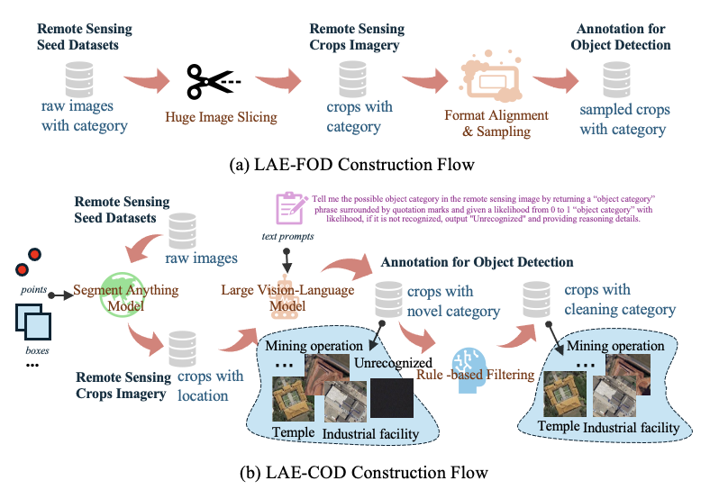

<div align="center">
<h1 align="center">  Locate Anything on Earth: Advancing Open-Vocabulary Object Detection for Remote Sensing Community</h1>

<h4 align="center"><em>Jiancheng Pan*,     Yanxing Liu*,     Yuqian Fu✉,     Muyuan Ma,</em></h4>

<h4 align="center"><em>Jiahao Li,     Danda Pani Paudel,    Luc Van Gool,     Xiaomeng Huang✉ </em></h4>
<p align="center">
    
</p>

\* *Equal Contribution* &nbsp; &nbsp; Corresponding Author ✉

</div>

<p align="center">
<a href="http://arxiv.org/abs/2408.09110">"></a>
    <a href="http://arxiv.org/abs/2408.09110"></a>
</p>

<p align="center">
  <a href="#news">News</a> |
  <a href="#abstract">Abstract</a> |
  <a href="#engine">Engine</a> |
  <a href="#dataset">Dataset</a> |
  <a href="#model">Model</a> |
  <a href="#statement">Statement</a>
</p>

## TODO

- [X] Release LAE-Label Engine
- [X] Release LAE-1M Dataset
- [ ] Release LAE-DINO Model

## News

- [2025/2/5] We have open sourced the <a href="#dataset">LAE-1M Dataset </a>.
- [2025/2/5] The LAE-80C dataset, containing 80 classes, has been released as a new remote sensing OVD benchmark and can be quickly [downloaded](https://drive.google.com/drive/folders/1HPu97-f1SNF2sWm3Cdb2FHLRybdRbCtS?usp=sharing) here.
- [2025/1/17] We have open sourced the code for <a href="#engine">LAE-Label Engine </a>.
- [2024/12/10] Our paper of "Locate Anything on Earth: Advancing Open-Vocabulary Object Detection for Remote Sensing Community" is accepted [AAAI&#39;25](https://aaai.org/conference/aaai/aaai-25/), we will open source as soon as possible!
- [2024/8/17] Our paper of "Locate Anything on Earth: Advancing Open-Vocabulary Object Detection for Remote Sensing Community" is up on [arXiv](http://arxiv.org/abs/2408.09110).

## Abstract

Object detection, particularly open-vocabulary object detection, plays a crucial role in Earth sciences, such as environmental monitoring, natural disaster assessment, and land-use planning. However, existing open-vocabulary detectors, primarily trained on natural-world images, struggle to generalize to remote sensing images due to a significant data domain gap. Thus, this paper aims to advance the development of open-vocabulary object detection in remote sensing community. To achieve this, we first reformulate the task as Locate Anything on Earth (LAE) with the goal of detecting any novel concepts on Earth. We then developed the LAE-Label Engine which collects, auto-annotates, and unifies up to 10 remote sensing datasets creating the LAE-1M - the first large-scale remote sensing object detection dataset with broad category coverage. Using the LAE-1M, we further propose and train the novel LAE-DINO Model, the first open-vocabulary foundation object detector for the LAE task, featuring Dynamic Vocabulary Construction (DVC) and Visual-Guided Text Prompt Learning (VisGT) modules. DVC dynamically constructs vocabulary for each training batch, while VisGT maps visual features to semantic space, enhancing text features. We comprehensively conduct experiments on established remote sensing benchmark DIOR, DOTAv2.0, as well as our newly introduced 80-class LAE-80C benchmark. Results demonstrate the advantages of the LAE-1M dataset and the effectiveness of the LAE-DINO method.

<p align="center">
    
</p>

## Engine

### LAE-Label Engine Pipeline

The pipeline of our LAE-Label Engine. For LAE-FOD dataset, we use coco slice of open-source tools [SAHI](https://github.com/obss/sahi) to automatically slice COCO annotation and image files ([coco-slice-command-usage](https://github.com/obss/sahi/blob/main/docs/cli.md#coco-slice-command-usage)). For LAE-COD dataset, we build it with the following series of commands (<a href="###how-to-use-lae-label">How to use LAE-Label </a>).

We uniformly convert to COCO format.

<p align="center">
    
</p>

### How to use LAE-Label

(Optional) For high resolution remote sensing images, we crop to `1024x1024` size,

```
python LAE-Label/crop_huge_images.py --input_folder ./LAE_data/DATASET --input_folder --output_folder ./LAE_data/DATASET_sub
```

SAM is then used to obtain the region of interst (RoI) of the image,

```
python LAE-Label/det_with_sam.py --checkpoint ./models/sam_vit_h_4b8939.pth --model-type 'vit_h' --input path/to/images/ --output ./LAE_data/DATASET_sub/seg/ --points-per-side 32 --pred-iou-thresh 0.86 --stability-score-thresh 0.92 --crop-n-layers 1 --crop-n-points-downscale-factor 2 --min-mask-region-area 10000
```

Then crop to get the RoI,

```
python LAE-Label/crop_rois_from_images.py --img_dir ./LAE_data/DATASET_sub/ --base_dir ./LAE_data/DATASET_sub/seg/ --out_dir ./LAE_data/DATASET_sub/crop/ --N 10 --end jpg
```

The currently used current open source model with the best multimodal macromodel results, InternVL, provides two versions, the front is the basic version, but the weight is too large, the latter model with `16% of the model size, 90% of the performance`.

```
huggingface-cli download --resume-download OpenGVLab/InternVL-Chat-V1-5 --local-dir InternVL-Chat-V1-5
huggingface-cli download --resume-download OpenGVLab/Mini-InternVL-Chat-4B-V1-5 --local-dir Mini-InternVL-Chat-4B-V1-5
```

Use the LVLM model to generate the corresponding RoI categories according to the prompt template.

```
# local inference
python LAE-Label/internvl-infer.py --model_path ./models/InternVL-Chat-V1-5 --root_directory ./LAE_data/DATASET_sub/crop --csv_save_path ./LAE_data/DATASET_sub/csv/

# lmdeploy inference (ref: https://github.com/InternLM/lmdeploy)

python LAE-Label/internvl-infer-openai.py --api_key OPENAIAPIKEY --base_url https://oneapi.XXXX.site:8888/v1  --model_name "internvl-internlm2" --input_dir ./LAE_data/DATASET_sub/crop --output_dir ./LAE_data/DATASET_sub/csv/
```

(Optional) Then convert to [odvg dataset format](https://github.com/longzw1997/Open-GroundingDino/blob/main/data_format.md) for better post-processing and other operations,

```
python LAE-Label/dets2odvg.py
```

(Optional) If you want to see the RoI visualization, by querying the image in odvg format,

```
python LAE-Label/plot_bboxs_odvg_dir.py
```

(Optional) Further optimise the quality of the labelling and develop some rules,  refer [post process method](./LAE-Label/post_process/README.md).

Some examples of labelling using LAE-Label, but without rule-based filtering operations.

<p align="center">
    
</p>

## Dataset

LAE-1M dataset contains abundance categories composed of coarse-grained LAE-COD and fine-grained LAE-FOD. LAE-1M samples from these datasets by category and does not count instances of overlap duplicates when slicing.

<p align="center">
    
</p>

### Dowload LAE-1M Dataset

Download data can be downloaded through `Baidu disk` or `Onedrive`, the download address provided below is downloaded to the `./LAE-DINO` of the project.

Note: **LAE-Label Engine is continuously optimized, the quality of data annotation is also improved.** We try to explore higher quality data annotations, and dataset versions are iteratively updated. The current version dataset is v1.1, which is the best labelled version available. We also intend to build stable benchmarks based on this version.

> Baidu disk: [download link](https://pan.baidu.com/s/1uwGylPaR1slNzq0Ih4z-xg?pwd=gf59)

> Onedrive: [download link](https://1drv.ms/f/c/72d4076f2aa319be/EhpYDEA71mFOorBWIoxglwMBNuy3i3bbf2W1qi8IHBjOAA?e=mGThPR)

Once you have downloaded the dataset, you can extract the image files in all subdirectories with a shell command.
```
bash tools/unzip_all_images_files.sh
```

We have preserved the image catalog names of the original datasets (e.g. DOTA,DIOR et.al.) as much as possible, so it is possible to incrementally download parts (SLM, EMS) of the image data, and separate labeled files.

e.g. Extract `images` from origin datasets:

```
# DOTAv2 dataset
cd DOTAv2/
unzip images.zip

# DIOR dataset
cd DIOR/
unzip images.zip

# FAIR1M dataset
cd FAIR1M/
unzip images.zip

# NWPU-VHR-10 dataset
cd NWPU-VHR-10/
unzip images.zip


# HRSC2016 dataset
cd HRSC2016/
unrar x HRSC2016.part01.rar
mv Train/AllImages ../Train/AllImages

# RSOD dataset:
cd RSOD/
mkdir ../images
mv aircraft/JPEGImages ../images
mv oiltank/JPEGImages ../images
mv overpass/JPEGImages ../images
mv aircraft/JPEGImages ../images
```

### LAE-80C Benchmark

LAE-80C is sampled from the validation set of multiple remote sensing object detection datasets to filter the categories that are as semantically non-overlapping as possible. We combined these categories to create a benchmark with 80 categories.

<p align="center">
    
</p>

**There is a lack of larger categories of detection benchmarks for the remote sensing community.** The LAE-80C can be used alone as a standard for evaluating 80-class object detection in remote sensing scenarios. Here is a quick [download](https://drive.google.com/drive/folders/1HPu97-f1SNF2sWm3Cdb2FHLRybdRbCtS?usp=sharing) via google drive.

### Dataset Catalogue

The directory structure of the `./data` file is shown below. In order to unify the various structures, we can directly use the coco format data. `Power-Plant` is the `Condesing-Towering` of paper.

```
./data
├── LAE-80C
│   ├── images
│   ├── LAE-80C-benchmark_categories.json
│   ├── LAE-80C-benchmark.json
│   └── LAE-80C-benchmark.txt
├── LAE-COD
│   ├── AID
│   ├── EMS
│   ├── NWPU-RESISC45
│   └── SLM
└── LAE-FOD
    ├── DIOR
    ├── DOTAv2
    ├── FAIR1M
    ├── HRSC2016
    ├── NWPU-VHR-10
    ├── Power-Plant
    ├── RSOD
    └── Xview
```

## Model

The pipeline for solving the LAE task: LAE-Label Engine expands vocabulary for open-vocabulary pre-training; LAE-DINO is a DINO-based open-vocabulary detector with Dynamic Vocabulary Construction (DVC) and Visual-Guided Text Prompt Learning (VisGT), which has a pre-training and fine-tuning paradigm for open-set and closed-set detection.

<p align="center">
    
</p>

### Installation Environment

The experimental environment is based on [mmdetection](https://github.com/open-mmlab/mmdetection/blob/main/docs/zh_cn/get_started.md), the installation environment reference mmdetection's [installation guide](https://github.com/open-mmlab/mmdetection/blob/main/docs/zh_cn/get_started.md). Or refer to the following tutorial,

```
conda create --name lae python=3.8 -y
conda activate lae
cd LAE-DINO/mmdetection_lae
pip3 install torch==1.10.0+cu113 torchvision==0.11.1+cu113 torchaudio==0.10.0+cu113 -f https://download.pytorch.org/whl/cu113/torch_stable.html
pip install -U openmim
mim install mmengine
mim install "mmcv>=2.0.0"

# 开发并直接运行 mmdet
pip install -v -e .
pip install -r requirements/multimodal.txt
pip install emoji ddd-dataset
pip install git+https://github.com/lvis-dataset/lvis-api.git
```

### Train LAE-DINO Model

```
./tools/dist_train.sh configs/lae_dino/lae_dino_swin-t_pretrain_LAE-1M.py 4
```

Continuing training from the last training breakpoint,

```
./tools/dist_train_lae.sh configs/lae_dino/lae_dino_swin-t_pretrain_LAE-1M.py 4
```

### Test LAE-DINO Model

```
./tools/dist_test.sh configs/lae_dino/lae_dino_swin-t_pretrain_LAE-1M.py /path/to/model/ 4
```

## Statement

### Acknowledgement

This project references and uses the following open source models and datasets. Thanks also to `ETH Zürich` and `INSAIT` for partial computing support.

#### Related Open Source Models

- [MM-Grounding-DINO](https://github.com/open-mmlab/mmdetection/blob/main/configs/mm_grounding_dino/README.md)
- [segment-anything](https://github.com/facebookresearch/segment-anything?tab=readme-ov-file)
- [InternVL](https://github.com/OpenGVLab/InternVL/tree/main)
- [MTP](https://github.com/ViTAE-Transformer/MTP)

#### Related Open Source Datasets

- [DOTA Dataset](https://captain-whu.github.io/DOTA/dataset.html)
- [DIOR Dataset](http://www.escience.cn/people/gongcheng/DIOR.html)
- [FAIR1M Dataset](https://arxiv.org/abs/2103.05569)
- [AID Dataset](https://captain-whu.github.io/AID/)
- [RSICD Dataset](https://github.com/201528014227051/RSICD_optimal)
- [NWPU Dataset](https://gjy3035.github.io/NWPU-Crowd-Sample-Code/)

### Citation

If you are interested in the following work, please cite the following paper.

```
@misc{pan2024locateearthadvancingopenvocabulary,
    title={Locate Anything on Earth: Advancing Open-Vocabulary Object Detection for Remote Sensing Community}, 
    author={Jiancheng Pan and Yanxing Liu and Yuqian Fu and Muyuan Ma and Jiaohao Li and Danda Pani Paudel and Luc Van Gool and Xiaomeng Huang},
    year={2024},
    eprint={2408.09110},
    archivePrefix={arXiv},
    primaryClass={cs.CV},
    url={https://arxiv.org/abs/2408.09110}, 
}
```
